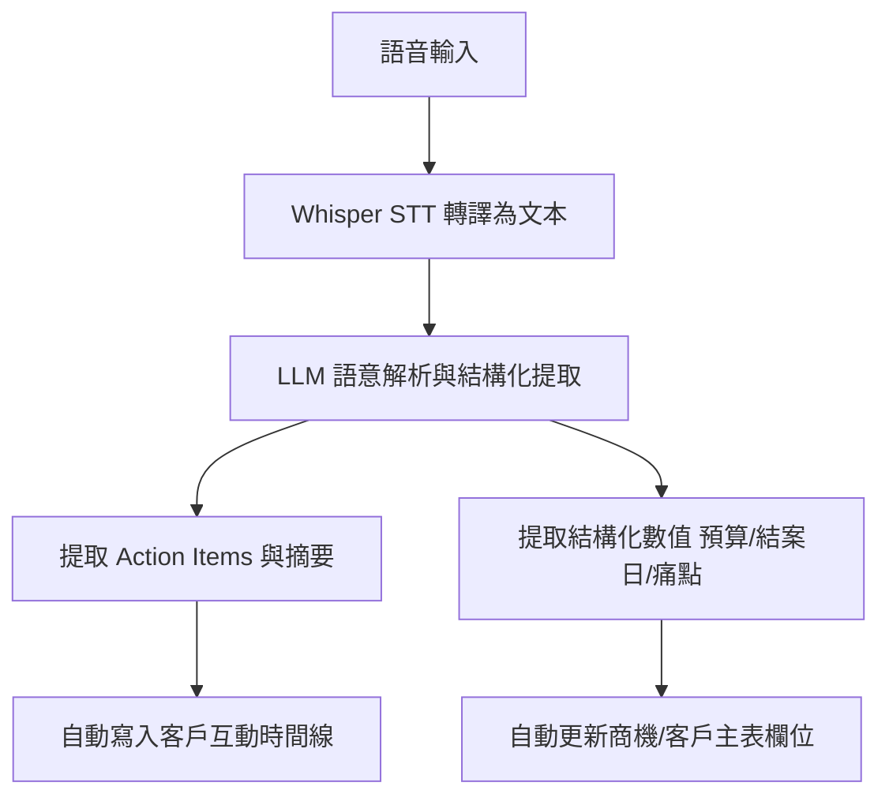

# AI CRM 創新擴充功能需求規格書 (PRD)

## 1. 文件概述 (Document Overview)

### 1.1 目的
本文件旨在既有的 AI CRM 智慧業務助理系統架構下，延伸規劃 6 項傳統 CRM 所不具備的 AI 核心擴充需求。本規格定義了各模組的功能範疇、業務價值、AI 處置流程與 UI 呈現標準，做為後續系統升級與開發之基準。

### 1.2 系統願景
將 CRM 從「被動的客戶資料記錄器」升級為「主動的業務增長與談判沙盒引擎」，利用大語言模型 (LLM)、語音轉文字 (STT) 與多智能體 (Multi-Agent) 技術，實現免手動輸入、主動風險預警與談判演練。

---

## 2. 系統架構與技術要求

- **LLM/Embeddings 接口**：整合 Gemini API 或 OpenAI API。
- **語音處理**：使用 OpenAI Whisper 或本機輕量 Whisper.cpp 進行會議/通話語音轉譯 (STT)。
- **資料儲存與檢索**：利用既有 PostgreSQL + pgvector 進行向量檢索 (RAG)。
- **Agent 框架**：採用基於 Blackboard 模式的輕量自主 Agent，或使用 LangGraph / AutoGen 進行多 Agent 協同工作。

---

## 3. 功能模組詳細規格

### 模組 1：AI Meeting Copilot (語音會議結構化助理)

#### 1.1 功能描述
業務與客戶開會或通話時，可直接錄音上傳或即時串流錄音。AI 自動將語音轉為逐字稿，並進行語意理解與結構化提取，自動更新至 CRM 對應客戶欄位。

#### 1.2 輸入數據
- 會議/通話 MP3/WAV 語音檔案或串流音訊。
- 客戶 ID（用於關聯與欄位比對）。

#### 1.3 AI 處理流程


#### 1.4 輸出與 UI 呈現需求
- **逐字稿對照面板**：左側展示時間軸逐字稿，右側展示 AI 提煉的「對話摘要」與「下一步行動 (Action Items)」。
- **欄位更新確認彈窗**：顯示 AI 偵測到的數值更新提示（例如：*「偵測到客戶提及預算變更為 TWD 1,500,000，是否更新商機？」*），經業務一鍵確認後寫入資料庫。

---

### 模組 2：Sentiment & Intent Radar (情緒與商機意圖雷達)

#### 2.1 功能描述
系統背景服務自動監控並分析業務與客戶來往的每一封郵件、通訊軟體紀錄或客服工單，主動辨識客戶的意圖強度與情緒波動。

#### 2.2 業務價值
- 提早防範客訴與合約流失。
- 主動發現潛在追加銷售 (Upsell) 或交叉銷售 (Cross-sell) 的商機意圖。

#### 2.3 規則與判定指標
- **情緒指數 (Sentiment Score)**：-1.0 (極度不滿) 到 +1.0 (極度滿意)。
- **意圖指標 (Intent Category)**：包含 `ASK_PRICING` (詢價)、`COMPARE_COMPETITOR` (競品比較)、`CHURN_SIGNAL` (流失信號)、`RENEWAL_INTEREST` (續約意願)。

#### 2.4 UI 呈現需求
- **警示儀表板**：在 Dashboard 報表區新增一個「情緒與流失雷達」警示欄。
- **警示通知卡片**：若情緒低於 -0.5 或是偵測到 `CHURN_SIGNAL`，即時在首頁彈出推播，並附帶 AI 建議的緊急關懷話術。

---

### 模組 3：Hyper-personalized Follow-up Copilot (超個人化開發信生成)

#### 3.1 功能描述
當業務需要向潛在或現有客戶發送郵件/訊息時，AI 能一鍵合成「客戶痛點 + 歷史互動焦點 + 客戶公司最新外部動態」，生成極度客製化的開發信或跟進草稿。

#### 3.2 數據合成來源
1. **內部資料**：CRM 互動歷史、最近一次會議摘要。
2. **外部資料**：透過搜尋引擎（如 Google Search API / Tavily）即時獲取客戶公司的最新公開新聞或產業動態。

#### 3.3 生成 Prompt 範例
```text
Role: 資深 B2B 軟體銷售經理
Input 1 (客戶資料): 產業為金融科技，痛點為資料合規與系統負載。
Input 2 (歷史紀錄): 上週開會提及正在考慮升級現有架構。
Input 3 (新聞): 該客戶昨日宣布與某大型銀行展開戰略合作。
Task: 撰寫一封精緻的跟進信件，祝賀其合作發布，並切入合規與擴展負載方案的提案。
```

#### 3.4 UI 呈現需求
- 在「客戶詳情」面板新增 **「一鍵生成跟進信」** 按鈕。
- 提供豐富的語調選擇（專業、誠懇、活潑、緊急）。
- 提供 Markdown 編輯器，業務可直接修改 AI 草稿並一鍵點擊呼叫 Outlook/預設郵件軟體發送。

---

### 模組 4：AI Negotiation Sandbox (客戶分身談判沙盒)

#### 4.1 功能描述
提供業務一個安全的「實戰演練沙盒」。AI 扮演特定客戶的決策角色，業務可以進行虛擬談判，演練報價與話術。

#### 4.2 AI 角色設定與對話限制
- AI 會讀取該客戶過往的客訴、價格敏感度（如過去對折扣的反應）以及競品偏好。
- AI 設定談判防線（例如：底線折扣為 85 折，超出此底線時必須拒絕並表達不滿）。

#### 4.3 演練評估指標
- **好感度 (Rapport Score)**：隨著業務的話術技巧起伏。
- **成交機率 (Close Probability)**：動態計算。
- **覆盤報告**：演練結束後，AI 提供分析報告，列出「亮點表現」與「待改善說詞」。

#### 4.4 UI 呈現需求
- 一個獨立的「談判沙盒 (Role-play Mode)」對話框。
- 帶有波動折線圖，即時顯示談判過程中客戶的「滿意度」與「報價接受度」變化趨勢。

---

### 模組 5：Autonomous Follow-up Agent (輕量線索自主跟進代理人)

#### 5.1 功能描述
業務可將低意向或未開發的潛在客戶（Leads）「一鍵委託」給 AI 自主代理人。AI 會在合適的排程時間自主發信，並根據客戶回覆進行互動。

#### 5.2 決策樹與安全閘門 (Guardrails)
```text
[觸發跟進] ──> AI 產生問候信 ──> [安全過濾審查] ──> 發送
                                           │
  ┌────────────────────────────────────────┘
  ▼
[客戶回信] ──> AI 分析意圖
                  ├─> 一般 Q&A ──> RAG 查詢產品手冊 ──> 自動回信
                  ├─> 強意向 (詢價/約會) ──> 發送預約會議連結 & 通知人類業務
                  └─> 特殊狀況 (客訴/負面) ──> 立即暫停委託 ──> 轉交人類業務
```

#### 5.3 UI 呈現需求
- 在客戶列表旁新增 **「託管給 AI Agent」** 的開關切換器。
- 提供「自主代理日誌」面板，供業務隨時抽查 AI 代理人已發送的郵件與客戶的對答紀錄。

---

### 模組 6：AI Power Mapping (組織決策鏈圖譜)

#### 6.1 功能描述
AI 透過分析與客戶公司多個聯絡人的郵件抄送 (CC) 關係、會議發言紀錄與言談語意，自動繪製出非官方的「組織內部決策權力圖譜」。

#### 6.2 角色定位分類
- **決策者 (Decision Maker)**：掌握資金與最終決定權。
- **評估者 (Gatekeeper / Validator)**：負責技術或合規把關。
- **內部支持者 (Champion)**：對我方產品高度支持，能提供內部情報。
- **反對者 (Blocker)**：偏好競品或反對變更。

#### 6.3 UI 呈現需求
- **動態節點關係圖**：使用 Force-directed Graph (力導向關係圖) 展示成員節點。
- 節點邊線粗細代表聯絡頻率，節點顏色代表對我方的好感度（綠色為 Champion，紅色為 Blocker），並用階層關係展示真正的決策影響力鏈。

---

## 4. 安全、隱私與合規性

- **隱私脫敏**：在上傳至第三方大模型 API 前，系統必須過濾或模糊化敏感隱私數據（如個人身份證字號、特定報價敏感數據等，使用預設的 Regex PII 遮罩）。
- **授權隔離**：AI 產出的分析報告與 Trace 必須嚴格遵循 CRM 的角色權限隔離（例如 SALES 權限者無法查閱專屬於 MANAGER 路由的敏感決策分析）。
